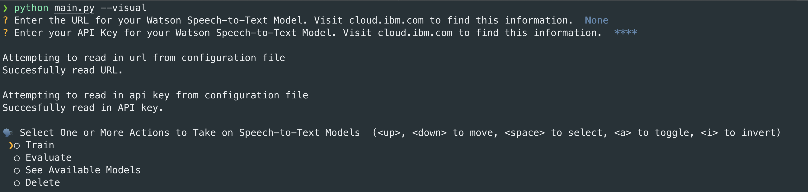
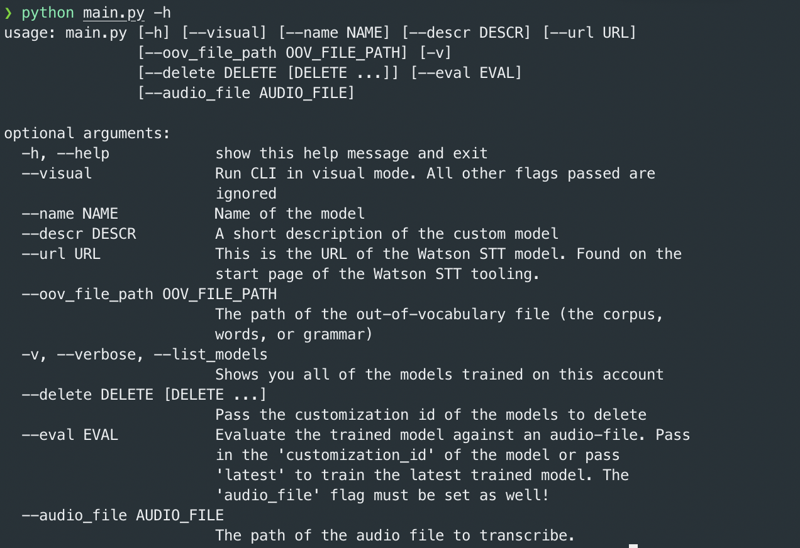
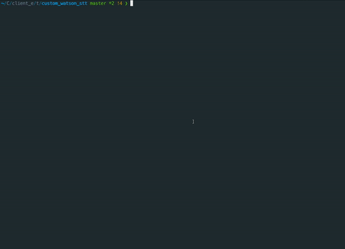
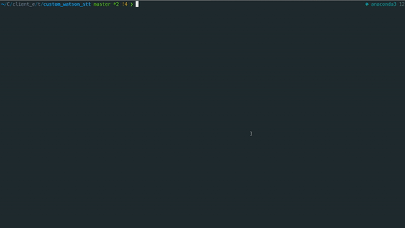
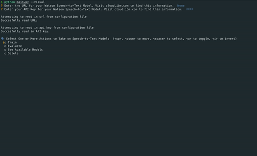

## Watson Speech-to-Text CLI

*Watson Assistant CLI* is a wrapper around the *[IBM Watson Speech-to-Text API](https://cloud.ibm.com/apidocs/speech-to-text/speech-to-text#create-a-custom-language-model)* that allows you to add custom vocabulary, grammar, and corpus as well train, test, and delete your models. The CLI allows you to perform these steps through a visual, interactive interface or directly through the command line. 

---

## Visual Mode

    python3 main.py --visual

The CLI prompts by asking you the URL and API key of your Speech-to-Text model. This information is found by clicking on your instance under *Service* tab after logging into [your cloud account](http://cloud.ibm.com). 

When using the visual mode, it saves the URL and API key, so for subsequent runs you can simply skip this step by pressing enter.

---

## Direct Mode

To interact directly with the CLI, **don't** pass the *—visual*  flag. When interacting directly, you must pass the *—url* flag.

---

## Table of Contents

1. Installation 
2. Visual Mode
    1. Training
    2. Evaluating
    3. See Available Models
    4. Delete
3. Direct Mode 
    1. Training
    2. Evaluating
    3. See Available Models
    4. Delete

## Installation

### Requirements

1. [python 3.*](https://realpython.com/installing-python/)
2. [pip](https://pip.pypa.io/en/stable/installing/) 
3. [git](https://git-scm.com/book/en/v2/Getting-Started-Installing-Git) 
4. [virtualenv](https://packaging.python.org/guides/installing-using-pip-and-virtual-environments/)

### Installation

1. Clone the repository: `git clone https://github.ibm.com/pratyushsingh/watson_stt_custom_models_cli.git`
2. Create and activate *virtualenv* for the project to create an environment to install the dependencies:
    1. `python3 -m pip install --user virtualenv`
    2. `python3 -m venv custom_watson_stt_cli`
    3. `source env/bin/activate`
3. Install the dependencies: `pip install -r requirements.txt`

---

## Visual Mode Usage

The CLI prompts you with multiple options to train, evaluate, see existing trained models, and delete models. With the prompt, you can select multiple options, and the CLI will execute each one.

1. Training 
    1. When training, the CLI prompts for the *name of model, description of the model,* and *path of the corpus (or grammar, or out-of-vocabulary words).* For the path, provide the full path of the training data.
    2. Once the information is provided, the CLI will upload the resources, create the model, and train it.

    

2. Evaluating *aka Transcribing Audio Data*
    1. With the evaluate option chosen, the CLI prompts for the path of the audio file, and presents a list of models to choose to transcribe the audio. You can choose multiple models to transcribe the audio file. 
    2. The models are presented in reverse chronological order from the date they were trained. In other words, *your latest trained model appears first.*

    

3. Seeing Trained Models 
    1. The CLI will list your trained models in reverse chronological order.

    

4. Delete Models
    1. You can delete all of your models or select which ones you want to delete.

    

    ---

    ## Direct Mode

### Train
`python main.py --url <URL> --name <NAME> --descr <DESCRIPTION> --oov_file_path <PATH_TO_TRAINING_DATA>`

### Evaluate
1. Evaluate your _latest_ trained model:
`python main.py --url <URL> --audio_file <PATH_TO_AUDIO_FILE> --eval latest`
2. To evaluate other models, you must pass in their customization id. You can evaluate multiple models at once.

### Delete
1. Delete all models
`python main.py --url <URL> --delete all`
2. Delete specific models
`python main.py --url <URL> --delete <CUSTOMIZATION_IDS>`

### See Models Created and Trained on an Instance
`python main.py --url <URL> --visual`
